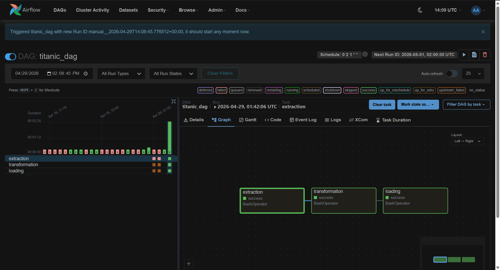
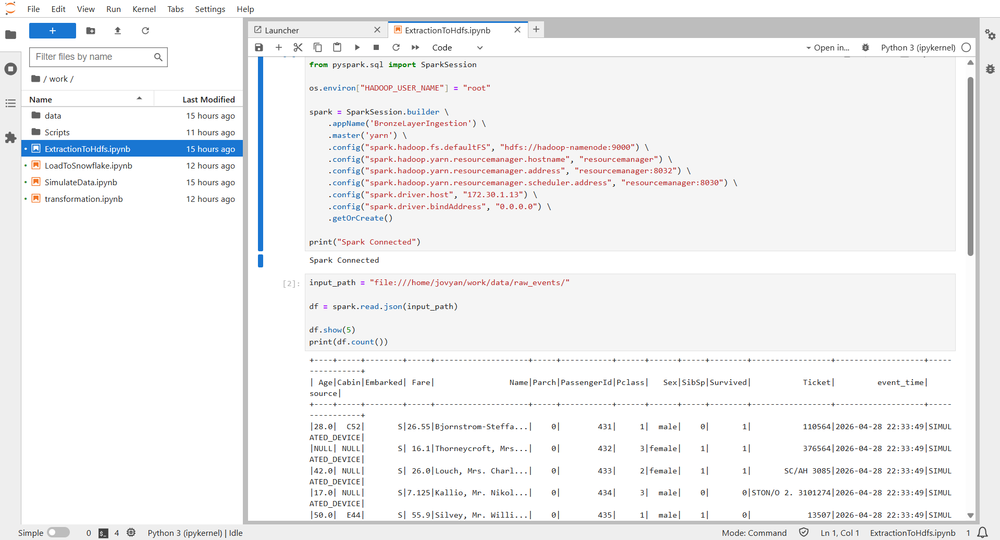
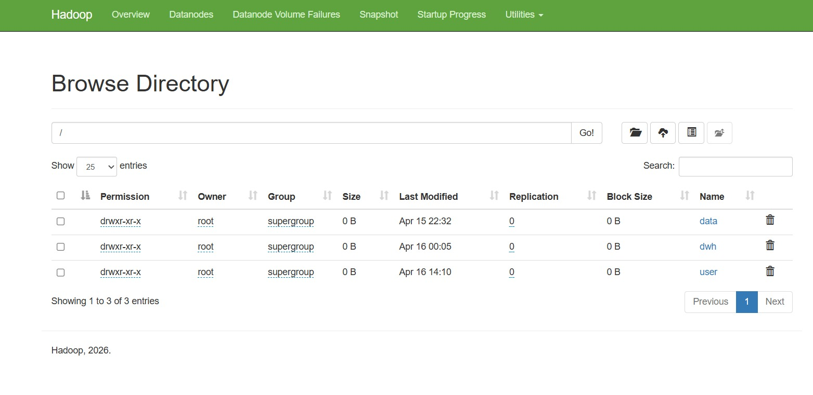
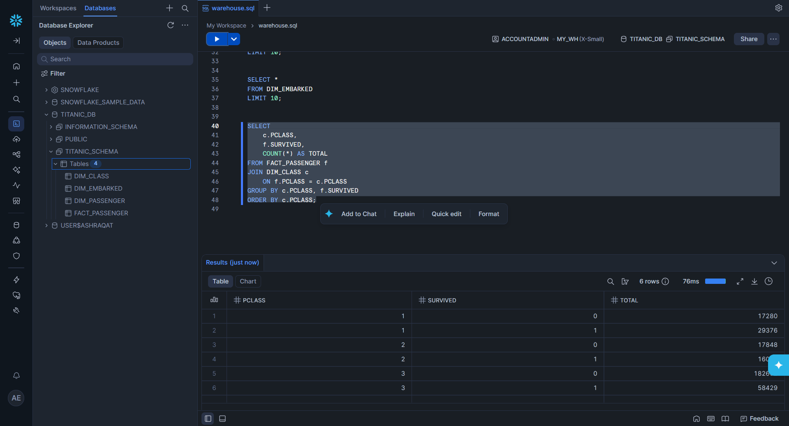

# 🚢 Titanic Data Pipeline (End-to-End Data Engineering Project)

## 📌 Overview

This project demonstrates a complete **Data Engineering pipeline** built using:

* **Apache Airflow** → Orchestration
* **Apache Spark (PySpark)** → Data processing
* **Hadoop HDFS** → Data storage (Bronze & Gold layers)
* **Snowflake** → Data warehouse
* **Docker Compose** → Infrastructure setup

The pipeline simulates streaming data, processes it, and loads it into a data warehouse using an automated workflow.

---

## 🏗️ Architecture

```
Simulation → Raw (JSON) → Spark → Bronze (HDFS) → Transformation → Gold (Star Schema) → Snowflake
                                      ↑
                                   Airflow DAG
```

---

## ⚙️ Infrastructure Setup

The entire environment is containerized using **Docker Compose**, which includes:

* Airflow (Webserver, Scheduler, Triggerer)
* PostgreSQL (Airflow metadata DB)
* Spark (via Jupyter Notebook container)
* Hadoop Cluster (NameNode, DataNodes, ResourceManager)

To start the project:

```bash
docker-compose up -d
```

---

## 📊 Data Simulation

A notebook (`simulation.ipynb`) simulates streaming data by:

* Reading Titanic dataset
* Splitting into batches
* Writing JSON files every few seconds
* Adding metadata like:

  * event_time
  * source

---

## 🥉 Bronze Layer (Ingestion)

* Reads raw JSON files from local storage
* Uses Spark to process data
* Writes data to **HDFS (Parquet format)**

📂 Output:

```
/datalake/bronze/sensor_data/
```

---

## 🥇 Transformation Layer (Gold)

Data cleaning and feature engineering:

* Handle missing values (Age, Fare, Embarked)
* Data type casting
* Feature engineering:

  * FamilySize
  * IsAlone
  * FarePerPerson
  * AgeBucket
* Drop unnecessary columns
* Remove duplicates

### ⭐ Star Schema Design:

* Fact Table:

  * `fact_passenger`
* Dimension Tables:

  * `dim_passenger`
  * `dim_embarked`
  * `dim_class`

📂 Output:

```
/datalake/gold/
```

---

## ❄️ Loading to Snowflake

* Reads Gold layer from HDFS
* Loads data into Snowflake tables:

  * FACT_PASSENGER
  * DIM_PASSENGER
  * DIM_EMBARKED
  * DIM_CLASS

---

## 🔄 Workflow Orchestration (Airflow DAG)

The pipeline is automated using an Airflow DAG:

### DAG Tasks:

1. Extraction
2. Transformation
3. Loading

### Execution:

* Runs monthly
* Executes Spark jobs inside Docker container

```python
extraction >> transformation >> loading
```

---

## 📁 Project Structure

```
├── dags/
│   └── titanic_dag.py
├── notebooks/
│   ├── simulation.ipynb
│   ├── extraction.ipynb
│   ├── transformation.ipynb
│   ├── loading.ipynb
│   └── Scripts/
│       ├── extraction.py
│       ├── transformation.py
│       └── loading.py
├── data/
├── docker-compose.yml
└── README.md
```

---

## 🚀 Key Features

* End-to-end pipeline (Batch simulation → Warehouse)
* Medallion Architecture (Bronze → Gold)
* Star Schema modeling
* Fully containerized environment
* Automated workflow using Airflow
* Integration with Snowflake

---

## 🧠 Future Improvements

* Add **Kafka** for real streaming
* Implement **CI/CD pipeline**
* Add **data quality checks**
* Use **Delta Lake** instead of Parquet
* Dashboard using Power BI / Tableau

---

## 📸 Screenshots

### Airflow DAG


### Spark Processing


### HDFS Storage


### Snowflake Output

